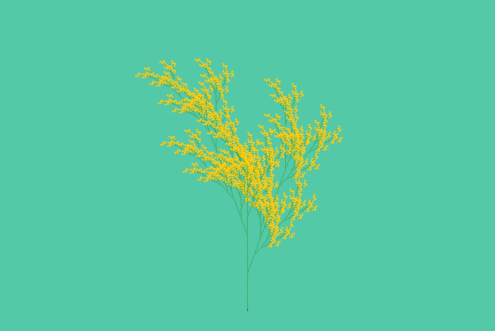

# webgarden

https://pierriccardo.github.io/webgarden

A website to experiment with L-Systems, for now limited to 2D. 
Rules can be modified, the list below shows the symbols implemented and their effects:

- F: move forward
- f: forward without drawing
- [: start a branch 
- ]: complete a branch
- +: rotate right by **angle**
- O: draw a flower

